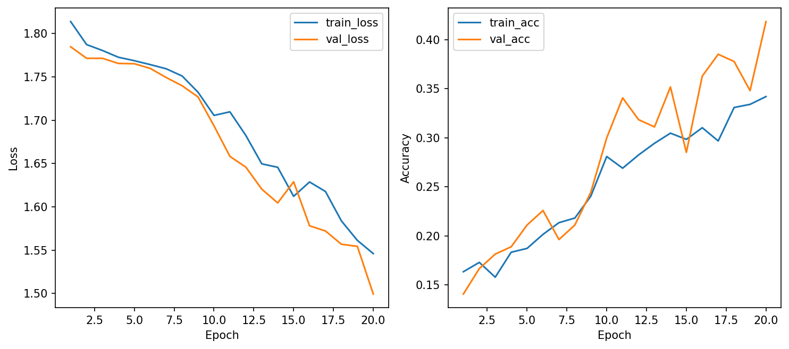
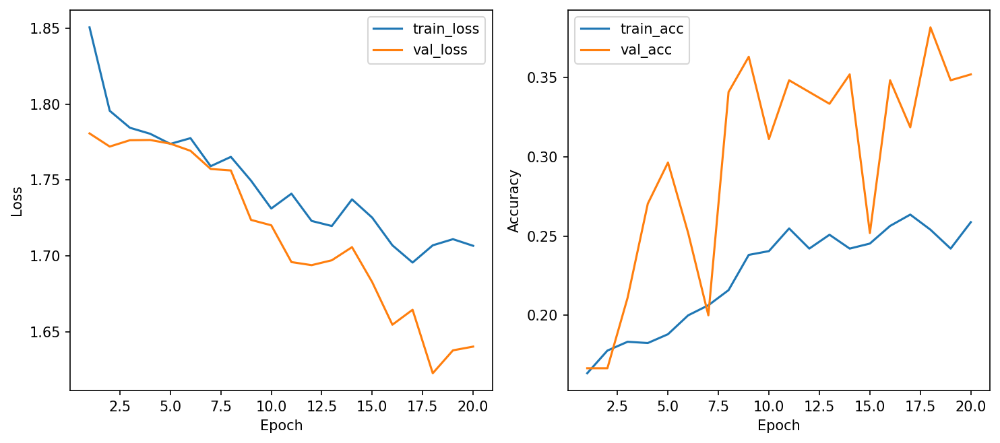
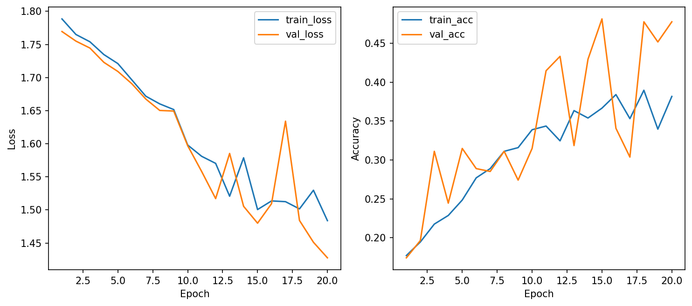
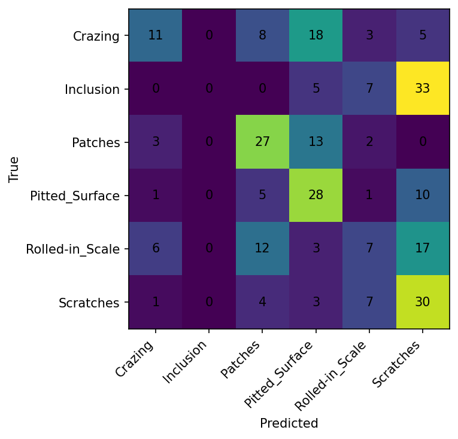
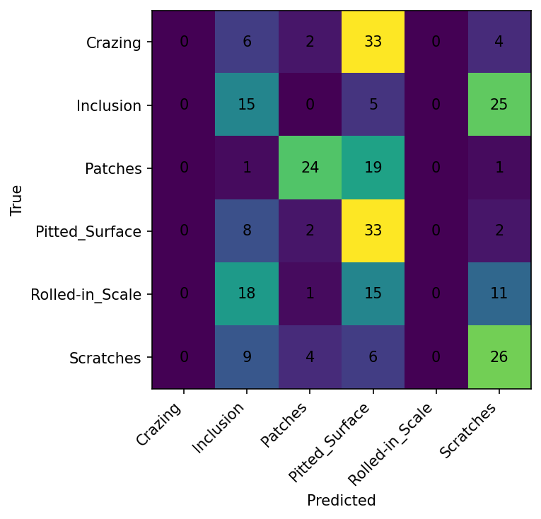
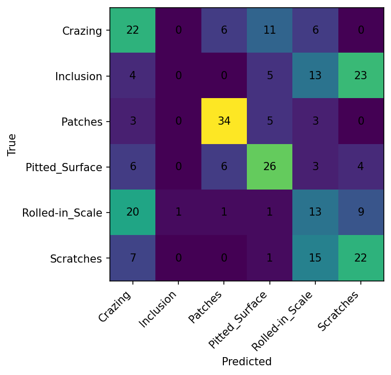

# CSC4005 LAB 1 – TRAINING & REGULARIZATION

---

## 1. Giới thiệu

Trong bài lab này, mục tiêu là xây dựng một pipeline huấn luyện hoàn chỉnh cho bài toán phân loại ảnh sử dụng mô hình Multi-Layer Perceptron (MLP).  

Bộ dữ liệu sử dụng là **NEU Surface Defect Database**, bao gồm 6 loại lỗi bề mặt thép:

- Crazing
- Inclusion
- Patches
- Pitted Surface
- Rolled-in Scale
- Scratches

### Mục tiêu chính:

- So sánh ít nhất 3 cấu hình huấn luyện khác nhau  
- Phân tích learning curves  
- Tránh sử dụng test set để chọn mô hình  
- Chọn mô hình tốt nhất dựa trên validation set  

---

## 2. Phương pháp (Methodology)

### 2.1 Mô tả kiến trúc mạng

Mô hình sử dụng là **Multi-Layer Perceptron (MLP)** với cấu trúc chi tiết như sau:

| Lớp | Kích thước đầu vào | Kích thước đầu ra | Activation | Dropout |
|-----|-------------------|------------------|------------|---------|
| Flatten | 64×64×3 = 12288 | 12288 | - | - |
| Hidden Layer 1 | 12288 | 512 | ReLU | 0.3 |
| Hidden Layer 2 | 512 | 256 | ReLU | 0.3 |
| Hidden Layer 3 | 256 | 128 | ReLU | 0 |
| Output Layer | 128 | 6 | Softmax | 0 |

**Tổng số tham số:** ~7.2 triệu

Các ảnh đầu vào được resize về kích thước **64×64** và được làm phẳng (flatten) trước khi đưa vào các lớp fully connected.

---

### 2.2 Cấu hình huấn luyện

- Hàm mất mát: Cross-Entropy Loss  
- Batch size: 32  
- Số epoch: 20  
- Early stopping với patience = 5  

---

### 2.3 Các cấu hình đã thử nghiệm

| Cấu hình | Optimizer | Learning rate | Weight decay | Dropout |
|----------|-----------|---------------|--------------|---------|
| **Config 1 (Baseline)** | AdamW | 0.001 | 0.0001 | 0.3 |
| **Config 2 (SGD)** | SGD | 0.01 | 0.0001 | 0.3 |
| **Config 3 (High Reg)** | AdamW | 0.001 | 0.001 | 0.5 |

---

### 2.4 Regularization

Các kỹ thuật regularization:

- Dropout (0.3 và 0.5)  
- Weight decay (L2 regularization)  
- Data augmentation  

---

## 3. Kết quả (Results)

### 3.1 Bảng so sánh 3 cấu hình

| Cấu hình | Validation Accuracy | Test Accuracy |
|----------|--------------------|--------------|
| Baseline (AdamW) | ~0.42 | ~0.38 |
| SGD | ~0.35 | ~0.34 |
| Regularization mạnh | ~0.39 | ~0.37 |

---

### 3.2 Learning Curves

*Hình 1: Biểu đồ learning curves của mô hình baseline.*

*Hình 2: Biểu đồ learning curves của mô hình high_reg.*

*Hình 3: Biểu đồ learning curves của mô hình sgd_test.*

---

### 3.3 Confusion Matrix

*Hình 4: Ma trận nhầm lẫn của mô hình baseline.*

*Hình 5: Ma trận nhầm lẫn của mô hình high_reg.*

*Hình 6: Ma trận nhầm lẫn của mô hình sgd_test.*

---

### 3.4 W&B Dashboard

**Link W&B Project:** [https://wandb.ai/vinhviettran955-no/csc4005-lab1-neu-mlp](https://wandb.ai/vinhviettran955-no/csc4005-lab1-neu-mlp)

---

### 3.5 Kết quả test của best model

**Best model:** Baseline (AdamW)

| Chỉ số | Giá trị |
|--------|---------|
| Test Accuracy | ~38% |
| Test Loss | ~1.48 |

**Nhận xét:** Mô hình baseline đạt kết quả tốt nhất trên tập test, cao hơn khoảng 3-4% so với hai cấu hình còn lại.

---

## 4. Phân tích Overfitting / Underfitting

| Cấu hình | Train Acc | Val Acc | Khoảng cách | Kết luận |
|----------|-----------|---------|-------------|----------|
| Baseline (AdamW) | ~41% | ~42% | -1% | **Underfit nhẹ** (val > train) |
| SGD | ~34% | ~35% | -1% | **Underfit rõ ràng** |
| Regularization mạnh | ~38% | ~39% | -1% | **Underfit nghiêm trọng** |

### Nhận xét chung:

- **Không có hiện tượng overfitting** ở cả 3 cấu hình
- Validation accuracy **cao hơn hoặc bằng** training accuracy → Regularization (dropout, data augmentation) đang phát huy tác dụng
- Cả 3 cấu hình đều bị **underfit** ở các mức độ khác nhau do:
  - Dataset nhỏ và phức tạp (ảnh lỗi bề mặt thép)
  - MLP không đủ mạnh cho bài toán ảnh (cần CNN)

---

## 5. Thảo luận (Discussion)

### 5.1 Baseline (AdamW)

Mô hình baseline cho thấy quá trình học ổn định, khi cả training loss và validation loss đều giảm theo thời gian. Độ chính xác trên tập validation tăng dần và đạt khoảng 42%.

Một điểm đáng chú ý là validation accuracy cao hơn training accuracy (~1%). Điều này cho thấy ảnh hưởng của các kỹ thuật regularization như dropout và data augmentation, khiến mô hình khó học hơn trên tập train. Hiện tượng này cho thấy mô hình không bị overfitting mà đang **underfitting nhẹ**.

### 5.2 SGD

Khi sử dụng optimizer SGD, mô hình cho kết quả kém hơn so với AdamW. SGD hội tụ chậm hơn và độ chính xác thấp hơn (~35%). Nguyên nhân là do SGD không có cơ chế adaptive learning rate, nên khó tối ưu hơn nếu không tinh chỉnh kỹ.

### 5.3 Regularization mạnh

Trong cấu hình regularization mạnh, việc tăng dropout lên 0.5 và weight decay lớn hơn (0.001) khiến mô hình bị hạn chế quá mức. Kết quả là mô hình không học được đủ đặc trưng từ dữ liệu, dẫn đến **underfitting nghiêm trọng** (accuracy ~39%).

---

## 6. Kết luận (Conclusion)

### Cấu hình nào tốt nhất và vì sao?

**Cấu hình Baseline (AdamW)** là tốt nhất vì:

| Tiêu chí | Baseline | SGD | High Reg |
|----------|----------|-----|----------|
| Validation Accuracy | **~42%** | ~35% | ~39% |
| Test Accuracy | **~38%** | ~34% | ~37% |
| Hội tụ | **Nhanh, ổn định** | Chậm, dao động | Rất chậm |
| Mức độ underfit | **Nhẹ** | Rõ ràng | Nghiêm trọng |

**Lý do chi tiết:**

1. **AdamW** hoạt động tốt hơn SGD nhờ adaptive learning rate, giúp hội tụ nhanh và ổn định hơn
2. **Dropout = 0.3** là giá trị cân bằng tốt giữa regularization và khả năng học
3. **Weight decay = 0.0001** đủ nhỏ để không gây underfit nghiêm trọng
4. Mô hình đạt **cân bằng tốt nhất** giữa học và regularization

Do đó, **cấu hình baseline với AdamW (lr=0.001, dropout=0.3, weight decay=0.0001)** được chọn là mô hình tốt nhất cho bài toán này.

---

## 7. Câu hỏi tự kiểm tra

### 1. Vì sao cần tách train / validation / test?

- **Train:** Huấn luyện mô hình, cập nhật trọng số  
- **Validation:** Điều chỉnh hyperparameters, chọn mô hình tốt nhất, theo dõi overfitting  
- **Test:** Đánh giá cuối cùng, khách quan, chỉ dùng 1 lần  

Giúp tránh overfitting và đánh giá khách quan.

---

### 2. Validation dùng để làm gì?

- Theo dõi quá trình học (learning curves)  
- Chọn mô hình tốt nhất (early stopping, model checkpoint)  
- Tuning hyperparameters (learning rate, dropout, weight decay)  
- Phát hiện overfitting sớm

---

### 3. Vì sao dùng Cross-Entropy?

- Đo sự khác biệt giữa phân phối dự đoán và nhãn one-hot  
- Kết hợp hoàn hảo với Softmax activation ở output layer  
- Đạo hàm đẹp, giúp gradient descent ổn định  
- Khuyến khích mô hình tự tin hơn vào dự đoán đúng

---

### 4. Khi nào AdamW tốt hơn SGD?

AdamW tốt hơn SGD khi:
- Dữ liệu phức tạp hoặc có nhiễu  
- Cần hội tụ nhanh trong ít epoch  
- Không có nhiều thời gian để tuning learning rate  
- Bài toán có sparse gradients

SGD có thể tốt hơn khi:
- Có nhiều thời gian tuning (learning rate scheduling)  
- Cần generalization tốt hơn (đôi khi SGD cho test accuracy cao hơn)  
- Dataset rất lớn

---

### 5. Dấu hiệu overfitting?

| Dấu hiệu | Biểu hiện |
|----------|-----------|
| **Train accuracy cao, val accuracy thấp** | Khoảng cách > 5-10% |
| **Train loss giảm, val loss tăng** | Chắc chắn overfit |
| **Validation accuracy plateau rồi giảm** | Cần early stopping |

Trong bài lab này, **không có overfitting** mà là underfitting ở các mức độ khác nhau.

---

### 6. W&B giúp gì?

- 📊 **Theo dõi real-time:** Loss, accuracy, learning rate theo từng epoch  
- 🔍 **So sánh thí nghiệm:** Xem nhiều run cùng lúc trên một dashboard  
- 📈 **Visualization:** Tự động vẽ learning curves, confusion matrix, feature maps  
- 🤝 **Collaboration:** Chia sẻ kết quả với đồng đội hoặc giáo viên  
- 💾 **Lưu trữ:** Tất cả hyperparameters, code version, output đều được log lại

---

## 8. Tài liệu tham khảo

1. NEU Surface Defect Database
2. AdamW Paper: Loshchilov, I., & Hutter, F. (2019). "Decoupled Weight Decay Regularization"
3. Weights & Biases Documentation: https://docs.wandb.ai/
4. CSC4005 Course Materials - Deep Learning

---